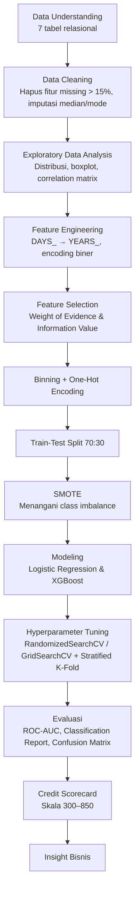

# 💳 Credit Risk Scoring — Home Credit Default Risk

Proyek *data science* end-to-end untuk memprediksi **risiko gagal bayar (default risk)** nasabah kredit menggunakan dataset **Home Credit Default Risk**, sekaligus membangun **credit scorecard** bergaya FICO (skala 300–850) dari model yang dihasilkan. Proyek ini merupakan *final project* yang dikerjakan melalui program **Rakamin Academy** (nama notebook: `Rakamin_FinProj.ipynb`).


---

## 📋 Daftar Isi

- [Tentang Proyek](#tentang-proyek)
- [Tentang Dataset](#tentang-dataset)
- [Struktur Repositori](#struktur-repositori)
- [Alur Metodologi](#alur-metodologi)
- [Instalasi](#instalasi)
- [Cara Menjalankan](#cara-menjalankan)
- [Hasil & Evaluasi Model](#hasil--evaluasi-model)
- [Credit Scorecard](#credit-scorecard)
- [Insight Bisnis](#insight-bisnis)
- [Teknologi yang Digunakan](#teknologi-yang-digunakan)
- [Rencana Pengembangan](#rencana-pengembangan)
- [Lisensi](#lisensi)
- [Kontak](#kontak)

---

<a id="tentang-proyek"></a>
## 📖 Tentang Proyek

Lembaga pembiayaan sering kesulitan menilai kelayakan kredit calon nasabah yang minim riwayat kredit formal, sehingga berisiko menolak nasabah yang sebenarnya layak (*missed opportunity*) atau menyetujui nasabah yang berisiko gagal bayar (*bad debt*). Proyek ini membangun model *machine learning* untuk memprediksi probabilitas gagal bayar seorang pemohon kredit berdasarkan data aplikasi, riwayat biro kredit, dan riwayat transaksi sebelumnya, lalu menerjemahkan model tersebut menjadi **skor kredit** yang mudah diinterpretasikan oleh tim bisnis.

Tujuan utama proyek:

1. Melakukan **eksplorasi & pembersihan data** (*Exploratory Data Analysis*) pada data aplikasi kredit berskala besar (300 ribu+ baris, 122 kolom).
2. Melakukan **seleksi fitur** menggunakan pendekatan **Weight of Evidence (WoE)** dan **Information Value (IV)** — teknik standar industri *credit scoring*.
3. Menangani **ketidakseimbangan kelas** (jumlah nasabah gagal bayar jauh lebih sedikit) menggunakan **SMOTE**.
4. Melatih dan membandingkan model **Logistic Regression** dan **XGBoost**, lengkap dengan *hyperparameter tuning* (`RandomizedSearchCV` & `GridSearchCV`) serta *Stratified K-Fold Cross Validation*.
5. Mengonversi koefisien model regresi logistik menjadi **scorecard kredit** berskala 300–850 (mirip skala FICO Score), sehingga hasil model dapat dibaca langsung oleh analis kredit non-teknis.
6. Menyajikan **insight bisnis** tambahan (mis. hubungan jumlah anggota keluarga, harga barang yang dibiayai, dan kepemilikan mobil terhadap risiko gagal bayar).

## 📊 Tentang Dataset

Proyek ini menggunakan dataset **[Home Credit Default Risk](https://www.kaggle.com/c/home-credit-default-risk/data)** dari kompetisi Kaggle, terdiri dari beberapa tabel relasional:

| Berkas | Deskripsi |
|---|---|
| `application_train.csv` | Data aplikasi kredit beserta label `TARGET` (307.511 baris × 122 kolom) — **data utama pelatihan model** |
| `application_test.csv` | Data aplikasi kredit tanpa label, digunakan untuk simulasi prediksi/skor akhir |
| `bureau.csv` | Riwayat kredit nasabah dari biro kredit lain |
| `bureau_balance.csv` | Riwayat saldo bulanan tiap kredit yang tercatat di biro kredit |
| `credit_card_balance.csv` | Riwayat saldo kartu kredit bulanan nasabah di Home Credit |
| `installments_payments.csv` | Riwayat pembayaran cicilan nasabah |
| `POS_CASH_balance.csv` | Riwayat saldo bulanan pinjaman POS & tunai sebelumnya |
| `previous_application.csv` | Riwayat pengajuan kredit sebelumnya di Home Credit |

**Target (`TARGET`)**: `1` = nasabah mengalami kesulitan pembayaran (telat > X hari pada salah satu cicilan awal), `0` = nasabah lain.

📁 Salinan berkas CSV dataset dapat diunduh melalui tautan berikut:
**[Unduh Dataset (Google Drive)](https://drive.google.com/drive/folders/1IRfqxD2iQockx3xSuFMORE8LYK7KwyBp?usp=sharing)**

> ⚠️ Notebook aslinya membaca data dari path lokal (`G:/PROJECT/Rakamin/home-credit-default-risk/...`). Sesuaikan path tersebut dengan lokasi penyimpanan berkas CSV di komputer Anda sebelum menjalankan ulang notebook (lihat [Cara Menjalankan](#cara-menjalankan)).

## 🗂 Struktur Repositori

```
Credit_Score/
├── Rakamin_FinProj.ipynb   # Notebook utama: EDA, feature engineering, modeling, scorecard, insight bisnis
└── README.md               # Dokumentasi proyek (file ini)
```

## 🔄 Alur Metodologi



### 1. Data Understanding & Cleaning
- Tujuh tabel data digabungkan/dieksplorasi (`application_train`, `application_test`, `bureau`, `bureau_balance`, `credit_card_balance`, `installments_payments`, `POS_CASH_balance`, `previous_application`).
- Fitur dengan **persentase nilai kosong > 15%** dibuang.
- Nilai kosong numerik diisi dengan **median**, nilai kosong kategorikal tertentu diisi dengan modus/kategori default (mis. `NAME_TYPE_SUITE` → `"Unaccompanied"`).
- Baris dengan kategori tidak valid (`NAME_FAMILY_STATUS == "Unknown"`) dibuang.

### 2. Exploratory Data Analysis (EDA)
- Analisis distribusi setiap fitur numerik (boxplot, histogram, KDE per kelas target) dan fitur kategorikal (count plot top-10 kategori).
- **Correlation matrix** antar fitur numerik.

### 3. Feature Engineering
- Fitur berbasis hari (`DAYS_BIRTH`, `DAYS_EMPLOYED`, `DAYS_REGISTRATION`, `DAYS_ID_PUBLISH`, `DAYS_LAST_PHONE_CHANGE`) dikonversi menjadi satuan **tahun** (`YEARS_BIRTH`, `YEARS_EMPLOYED`, dst.) agar lebih mudah diinterpretasikan.
- Fitur biner (`CODE_GENDER`, `FLAG_OWN_CAR`, `FLAG_OWN_REALTY`) di-*encode* menjadi 0/1.

### 4. Feature Selection — Weight of Evidence (WoE) & Information Value (IV)
Setiap fitur kategorikal maupun numerik (setelah *binning*) dihitung **WoE** dan **IV**-nya terhadap `TARGET` untuk mengukur kekuatan prediktifnya — pendekatan standar di industri *credit scoring*. Hasil analisis WoE divisualisasikan per fitur (`plot_woe`), dan **18 fitur** dengan daya prediktif terbaik dipilih untuk pemodelan, di antaranya:

`CODE_GENDER`, `FLAG_OWN_CAR`, `AMT_INCOME_TOTAL`, `AMT_CREDIT`, `AMT_ANNUITY`, `AMT_GOODS_PRICE`, `REGION_POPULATION_RELATIVE`, `CNT_FAM_MEMBERS`, `HOUR_APPR_PROCESS_START`, `EXT_SOURCE_2`, `OBS_30_CNT_SOCIAL_CIRCLE`, `OBS_60_CNT_SOCIAL_CIRCLE`, `AMT_REQ_CREDIT_BUREAU_YEAR`, `YEARS_BIRTH`, `YEARS_EMPLOYED`, `YEARS_REGISTRATION`, `YEARS_PUBLISH`, `YEARS_LAST_PHONE_CHANGE`.

### 5. Binning & One-Hot Encoding
Setiap fitur numerik terpilih dikelompokkan ke dalam beberapa *bin* (berdasarkan pola WoE-nya), lalu di-*one-hot encode* menjadi variabel biner — menghasilkan matriks fitur akhir yang siap dimodelkan.

### 6. Train-Test Split & Penanganan Class Imbalance
- Data dibagi **70% train / 30% test** (`random_state=51`).
- Karena jumlah nasabah gagal bayar jauh lebih sedikit (~11× lebih sedikit dari nasabah lancar), teknik **SMOTE (Synthetic Minority Over-sampling Technique)** diterapkan pada data latih untuk menyeimbangkan kedua kelas.

### 7. Pemodelan
Dua algoritma dilatih dan dibandingkan:

- **Logistic Regression** — dituning dengan `RandomizedSearchCV` (parameter `penalty` & `C`) + `StratifiedKFold` (5-fold), lalu koefisiennya digunakan untuk membangun scorecard.
- **XGBoost Classifier** — dituning dengan `GridSearchCV` atas kombinasi `max_depth`, `learning_rate`, `n_estimators`, `subsample`, `colsample_bytree`, dengan `scale_pos_weight` untuk menangani imbalance tambahan.

### 8. Evaluasi
Setiap model dievaluasi dengan **ROC-AUC Score**, **Classification Report** (precision, recall, F1-score), **Confusion Matrix**, **ROC Curve**, dan **KS Statistic Plot**.

### 9. Credit Scorecard
Koefisien model Logistic Regression (dari `statsmodels.OLS` sebagai pendukung interpretasi) dikonversi menjadi **poin skor per kategori fitur**, lalu diskalakan ke rentang **300 (terendah) – 850 (tertinggi)**, mengikuti konvensi skala skor kredit seperti FICO Score. Skor akhir tiap nasabah dihitung sebagai penjumlahan poin dari seluruh fitur yang dimilikinya.

## ⚙️ Instalasi

1. **Clone repositori ini**
   ```bash
   git clone https://github.com/abiyyufarhan/Credit_Score.git
   cd Credit_Score
   ```

2. **(Opsional) Buat virtual environment**
   ```bash
   python -m venv venv
   source venv/bin/activate      # Linux/Mac
   venv\Scripts\activate         # Windows
   ```

3. **Install dependensi yang dibutuhkan**

   Repositori ini belum menyertakan berkas `requirements.txt`, sehingga pustaka berikut perlu diinstal manual sesuai yang diimpor pada notebook:
   ```bash
   pip install pandas numpy matplotlib seaborn statsmodels scipy scikit-learn scikit-plot imbalanced-learn xgboost
   ```

4. **Unduh dataset** melalui [tautan Google Drive](#tentang-dataset) di atas dan letakkan pada satu folder (mis. `data/home-credit-default-risk/`).

## ▶️ Cara Menjalankan

1. Buka `Rakamin_FinProj.ipynb` dengan Jupyter Notebook/JupyterLab/VS Code.
2. Pada sel pembacaan data (`pd.read_csv(...)`), ubah path `G:/PROJECT/Rakamin/home-credit-default-risk/...` menjadi lokasi folder dataset Anda.
3. Jalankan seluruh sel secara berurutan dari atas ke bawah:
   - Data cleaning & EDA → Feature engineering → WoE/IV feature selection → Binning & encoding → SMOTE → Pemodelan (Logistic Regression & XGBoost) → Evaluasi → Pembuatan scorecard → Insight bisnis.
4. Proses `GridSearchCV` pada XGBoost cukup berat secara komputasi (72 kombinasi parameter × 5-fold CV); pastikan sumber daya komputer mencukupi atau kurangi ruang pencarian parameter bila diperlukan.

## 🏆 Hasil & Evaluasi Model

| Model | AUC Train | AUC Test | Catatan |
|---|---|---|---|
| **Logistic Regression** (tuned, WoE scorecard) | 0,645 | 0,645 | Akurasi keseluruhan 90%, namun recall kelas gagal bayar rendah (0,07) akibat kelas sangat tidak seimbang |
| **XGBoost** (`GridSearchCV`, terbaik dari pencarian) | — | 0,654 | Skor CV terbaik saat pelatihan (SMOTE) mencapai 0,970, mengindikasikan model cenderung *overfit* terhadap data hasil SMOTE |
| **XGBoost** (parameter tetap: `max_depth=7`, `n_estimators=200`, `lr=0.1`) | 0,779 | 0,652 | Performa test relatif sejalan dengan varian GridSearchCV di atas |

**Catatan interpretasi:**
- Kedua model menghasilkan **ROC-AUC test di kisaran 0,64–0,65**, yang tergolong *moderate* untuk kasus *credit scoring* — sejalan dengan tantangan umum dataset Home Credit Default Risk yang memang sulit diprediksi hanya dari data aplikasi mentah tanpa *feature engineering* lanjutan (skor eksternal `EXT_SOURCE_*` biasanya menjadi prediktor terkuat).
- Gap besar antara **AUC train (0,779–0,970)** dan **AUC test (~0,65)** pada XGBoost menunjukkan indikasi **overfitting**, terutama karena skor CV dihitung di atas data yang sudah di-SMOTE (bukan data test asli).
- **Recall kelas minoritas (nasabah gagal bayar) masih rendah** pada kedua model — area utama yang perlu ditingkatkan pada pengembangan berikutnya (lihat [Rencana Pengembangan](#rencana-pengembangan)).

## 💯 Credit Scorecard

Dari koefisien Logistic Regression, dibangun **scorecard kredit** dengan skala **300 (risiko tertinggi) – 850 (risiko terendah)**, mengikuti prinsip:

$$\text{Skor} = \text{koefisien fitur} \times \frac{\text{skor maks} - \text{skor min}}{\sum \text{koefisien maks} - \sum \text{koefisien min}}$$

Skor per kategori fitur dijumlahkan untuk menghasilkan **skor kredit akhir per nasabah**, yang juga dikonversi kembali ke **skala probabilitas (0–100%)** menggunakan fungsi sigmoid — memudahkan tim bisnis membaca hasil model baik dalam bentuk skor maupun probabilitas gagal bayar.

## 💡 Insight Bisnis

Selain pemodelan, notebook ini menyajikan beberapa analisis deskriptif untuk mendukung pengambilan keputusan bisnis:

- **Jumlah anggota keluarga** (`CNT_FAM_MEMBERS`) vs proporsi gagal bayar.
- **Harga barang yang dibiayai** (`AMT_GOODS_PRICE`) vs proporsi gagal bayar.
- **Kepemilikan mobil** (`FLAG_OWN_CAR`) berdasarkan gender vs rasio kesulitan pembayaran.

## 🛠 Teknologi yang Digunakan

| Kategori | Pustaka |
|---|---|
| Manipulasi Data | `pandas`, `numpy` |
| Visualisasi | `matplotlib`, `seaborn`, `scikit-plot` |
| Statistik | `statsmodels`, `scipy` |
| Machine Learning | `scikit-learn` (Logistic Regression, `RandomizedSearchCV`, `GridSearchCV`, `StratifiedKFold`), `xgboost` |
| Penanganan Imbalance | `imbalanced-learn` (SMOTE) |
| Lingkungan | Jupyter Notebook |

## 🚀 Rencana Pengembangan

- [ ] Menambahkan `requirements.txt` agar environment lebih mudah direproduksi.
- [ ] Melakukan *feature engineering* lanjutan dari tabel relasional (`bureau`, `previous_application`, `installments_payments`, dll.) yang saat ini belum sepenuhnya dimanfaatkan dalam model utama.
- [ ] Mengevaluasi model dengan **cross-validation pada data test asli** (bukan data SMOTE) untuk mendapatkan estimasi generalisasi yang lebih akurat dan mengurangi risiko overfitting.
- [ ] Menambahkan teknik penanganan imbalance alternatif (mis. `class_weight`, threshold tuning) untuk meningkatkan **recall** kelas gagal bayar.
- [ ] Menyimpan model & scorecard final (`pickle`/`joblib`) serta membangun API/antarmuka sederhana untuk simulasi skor kredit.
- [ ] Modularisasi notebook menjadi skrip `.py` terpisah per tahapan (data prep, feature selection, modeling, scoring).

## 📄 Lisensi

Lisensi proyek ini belum ditentukan oleh pemilik repositori. Silakan hubungi pemilik repositori atau tambahkan berkas `LICENSE` (mis. MIT License) jika ingin menggunakan ulang kode ini secara terbuka. Dataset yang digunakan tunduk pada [ketentuan penggunaan data kompetisi Home Credit Default Risk di Kaggle](https://www.kaggle.com/c/home-credit-default-risk/rules).

## 📬 Kontak

Dibuat oleh **[@abiyyufarhan](https://github.com/abiyyufarhan)**.

Untuk pertanyaan, saran, atau kontribusi, silakan buka [Issue](https://github.com/abiyyufarhan/Credit_Score/issues) baru di repositori ini.

---

<p align="center"><i>⭐ Jangan lupa beri bintang pada repositori ini jika bermanfaat!</i></p>
